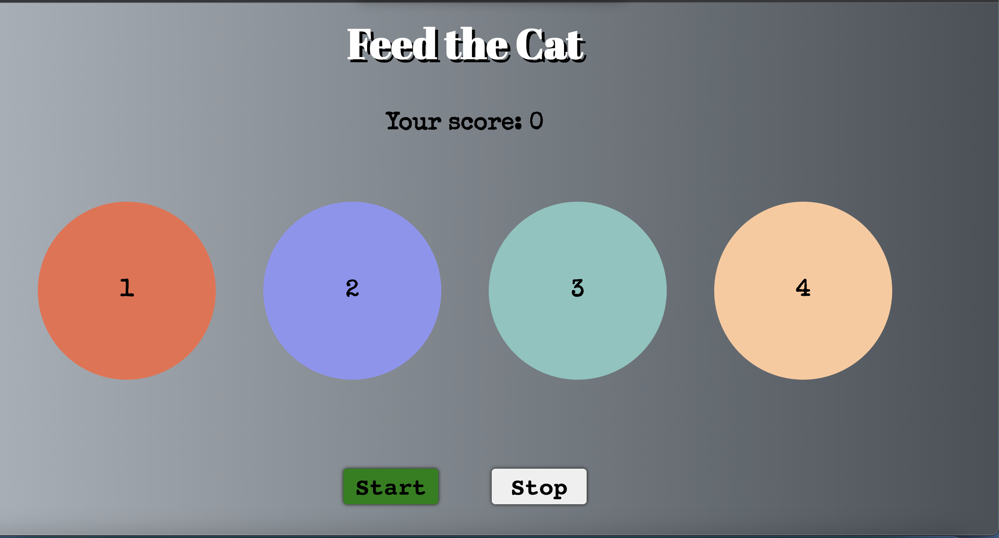

## Introduction

This is the cat game created using react app. Two buttons are added to start and end the game. Four circles are created with different colors and id. When player start the game with start button random circle gets activated and user should click on that activated circle to get the points. When player misses the several click pop up window with game over is displayed.

- [Deployed app in netlify](https://feed-the-cat-fish.netlify.app)

## installation

Run this command: npx create-react-app catMouse-app.

Then enter the created folder with cd catMouse-app.

You can now start the application with npm run start.

## Components

### Circle

creates four circle with unique id and color.

### GameOver

Component that creates popup window with game over text and final score.

### Images

Background svg image for the selected circle is created using figma's fontawesome font.

### Sounds

game start sound, game end and click sound are stored here which are played when game starts, game ends and player click the right circle.

## Screenshot

## Sources

- [reactjs documentation](https://reactjs.org/tutorial/tutorial.html)
- [Sound track](https://opengameart.org)
- [cat svg image](https://www.figma.com/)
